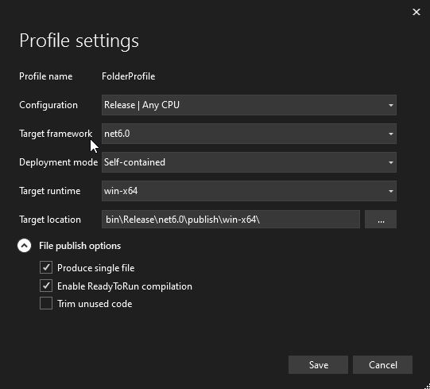
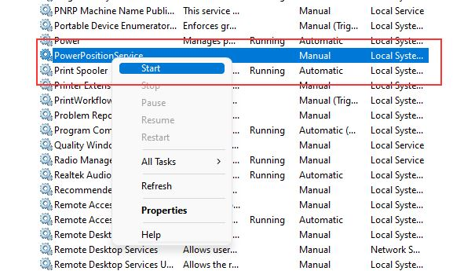
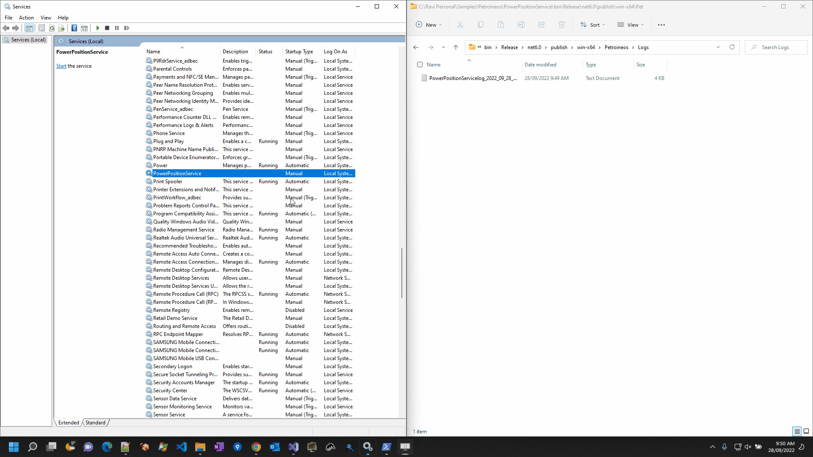

# PowerPositionService

Which Generates Power CSV's at scheduled interval.

# Requirements

- All trade positions are aggregated per hour
- CSV output in two columns (Local Time, Volume)
- CSV file will be generated in format PowerPosition_YYYYMMDD_HHMM.csv
- CSV file location, interval(set to 1 min in appsettings, Default is set to 5 min) are read from Appsettings
- None of the schedules will be missed
- Logging for prod support. Serilog is used for logging.
- Log file and CSV's will be created in the current Directory. 

# How to run the project

- User can Either Debug or Run it as a service
 >   Debug 
 - Build the project in visual studio
 - Run (Ctrl+F5) or Debug(F5)
 - Console will show where the log files and CSV's are being created.
 - Exceptions will be logged as Errors in the file
 
 > Running as a service
 
 - Right click on project and select "Publish" 
 - PowerPositionService.exe will be created in Release directory Release\net6.0\publish\win-x64\PowerPositionService.exe
 - Go to profile settings
 - Set options as follows
 - 
 - open powershell in admin mode
 - run following command to create a window service. NOTE: Provide full path to the exe
 - sc.exe create "PowerPositionService" start="demand" binpath="XXXXX\Release\net6.0\publish\win-x64\PowerPositionService.exe" 
 - Start the service
 - 
 - Log files and CSV's will be generated in "XXXX\Release\net6.0\publish\win-x64\Petroineos" 
 - Delete the service run the following command 
 - sc.exe delete "PowerPositionService"
 
 # Improvements or suggestions
 - No unit tests are written. Probably will take more time to submit the solution
 - When service is stopped the generating of csv files need to be stopped gracefully. Its stopped abruptly 

# DEMO
- 
-
# Author
- Ravi Bayyana
